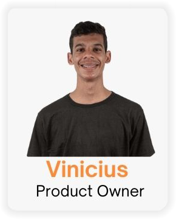
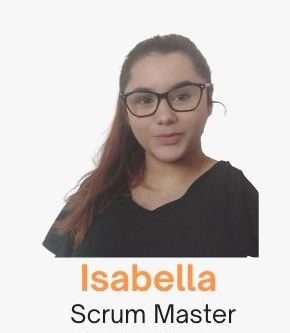
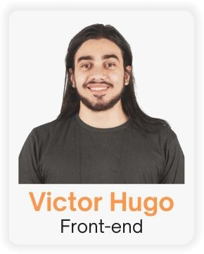
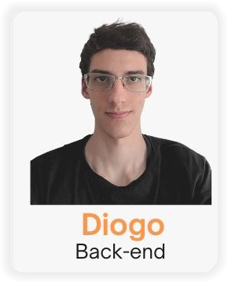
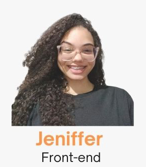
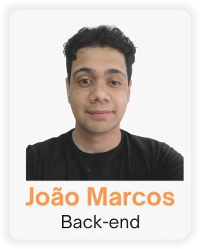
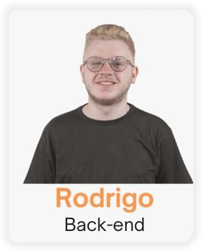

# AmiMais 

  

## Quem somos 
  Somos uma plataforma com o objetivo de direcionar animais resgatados em situação de ruas para a adoção e darmos visibilidade a ONG’s, empresas, resgatadores e
  participantes. Com nossa plataforma, seremos ponte entre elas e locais de adoção e abrigos de cuidado, conscientizando as pessoas dos cuidados e necessidades que 
  esses animais precisam.

 

*Screenshots retirada da plataforma **©Amimais***

## Como surgiu a ideia 

  Realizamos uma pesquisa em conjunto e concluímos que o número de abandono era assustador. Foi então que procuramos uma maneira de mudar esse cenário, queríamos 
  fazer com que as pessoas tivessem entendimento dessa problemática e pudessem se conscientizar com a mesma, então surgiu o AmiMais, com o intuito que todos amem 
  mais os animais.
  
## Integrantes 

  &nbsp;&nbsp;&nbsp;
  &nbsp;&nbsp;&nbsp;
  &nbsp;&nbsp;&nbsp;
  &nbsp;&nbsp;&nbsp;

  &nbsp;&nbsp;&nbsp;
  &nbsp;&nbsp;&nbsp;
  &nbsp;&nbsp;&nbsp;
  &nbsp;&nbsp;&nbsp;
  
  *Clique para conferir o **GitHub** de cada **integrante**.*

## Apresentação 

<a href="https://www.youtube.com/embed/zp2unSJIyMk" target_blank>
 
</a>

**PROA - Demo Day São Paulo - AmiMais**
> *Apresentação realizada dia 15/12/2022*

 

## Parcerias 

