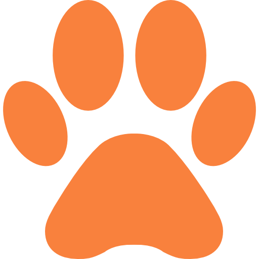
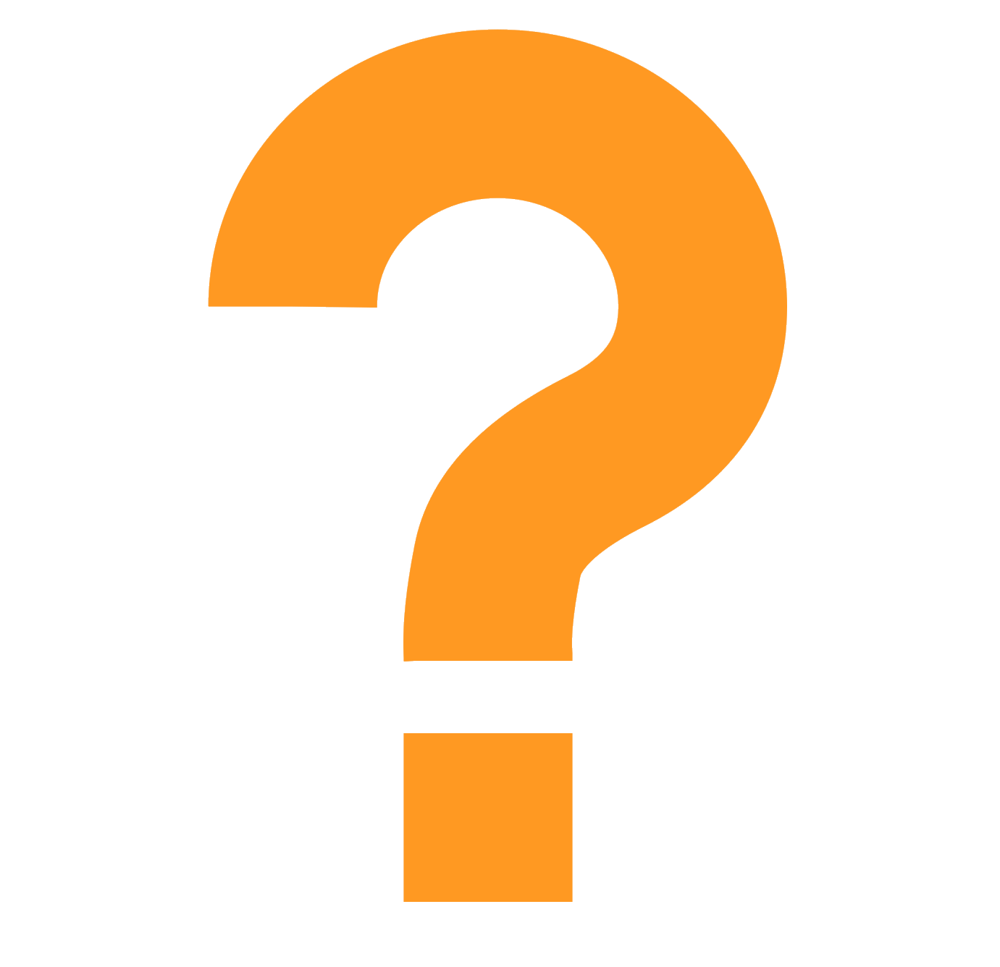
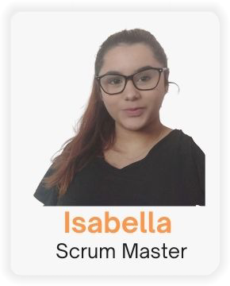
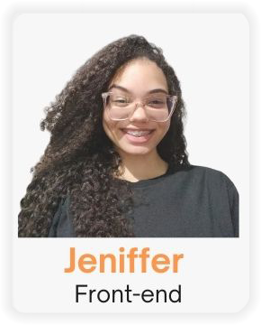
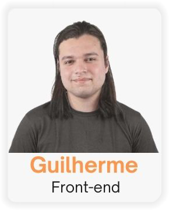
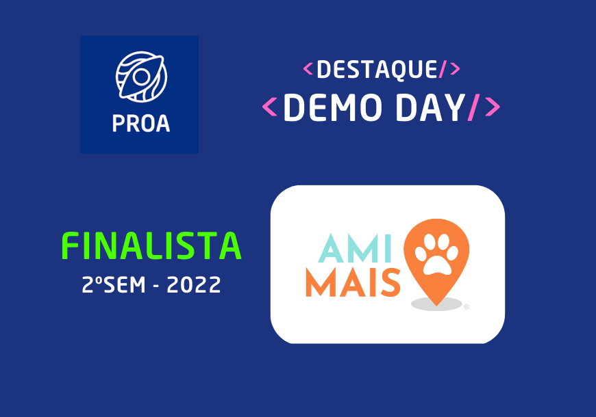
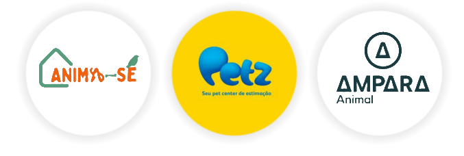

<!--Badge Images by @iuricode & @alexandresanlim -->
<!--Encuratador de Links https://www.encurtador.dev -->
<header>

  # AmiMais 
  
  
  
  
  
  
  
  
  
  
  
  

   
   
  
  

</header>
<section>

  ## Quem somos 
  Somos uma plataforma com o objetivo de direcionar animais resgatados em situação de ruas para a adoção e darmos visibilidade a ONG’s, 
  empresas, resgatadores e participantes. Com nossa plataforma, seremos ponte entre elas e locais de adoção e abrigos de cuidado, conscientizando 
  as pessoas dos cuidados e necessidades que esses animais precisam.

  

   

   *Screenshots retirada da plataforma **©Amimais***
  

</section>
<section>

  ## Como surgiu a ideia 
  Realizamos uma pesquisa em conjunto e concluímos que o número de abandono era assustador. Foi então que procuramos uma maneira de mudar esse cenário, 
  queríamos fazer com que as pessoas tivessem entendimento dessa problemática e pudessem se conscientizar com a mesma, então surgiu o AmiMais, com o 
  intuito que todos amem mais os animais. 

</section>
<section>

  ## Integrantes 
  

   &nbsp;&nbsp;&nbsp; 
   &nbsp;&nbsp;&nbsp; 
   &nbsp;&nbsp;&nbsp; 
   &nbsp;&nbsp;&nbsp;

   &nbsp;&nbsp;&nbsp; 
   &nbsp;&nbsp;&nbsp; 
   &nbsp;&nbsp;&nbsp; 
   &nbsp;&nbsp;&nbsp;

   *Clique para conferir o **GitHub** de cada **integrante**.*
  

</section>
<section>

  ## Apresentação 
  
  **PROA - Demo Day São Paulo - AmiMais** 
  > *Apresentação realizada dia 15/12/2022*
  
</section>
 
<footer>

  ## Parcerias 
  
  
</footer>
